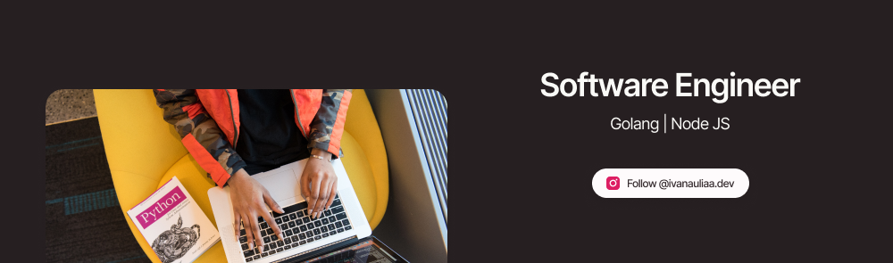

### 
A Back-end Engineer 👨‍💻 who always interested to learn something new 🚀

- 🌱 Currently learning: Back-End Service with clean architecture, automation testing, and CI/CD
- ⚡ Fun fact: Marvel Cinematic Universe (MCU) holic
- 🎯 I'm open for a project consultation session
- ❓ Let's discuss about related technologies, social connection, or secret wars & kang dynasty

</img>

</img>
</img>
</img>
</img>
</img>
</img>
</img>
</img>

---

  
### 
Follow and Subscribe for weekly software development content from me

### 
Get in Touch

