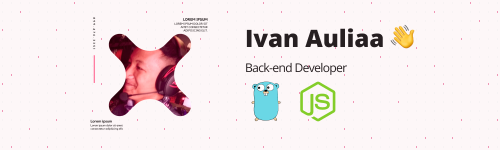

### 
A Back-end Developer 👨‍💻 who always interested to learn something new 🚀
  

- 🌱 Currently learning: GDRP tech stack
- ⚡ Fun fact: Marvel Cinematic Universe (MCU) fanboy
- ❓ Let's discuss about related technologies, social connection, or multiverse of madness  

  

## Skills & Tools

----

  
### 
Get in Touch

